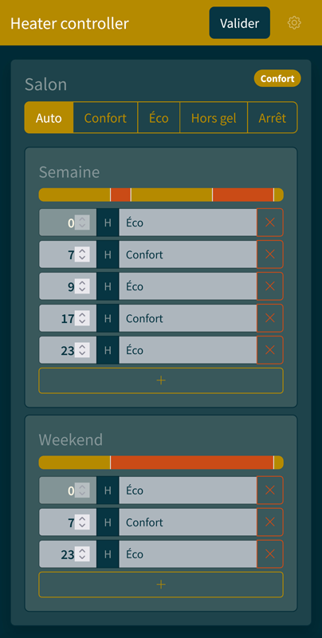
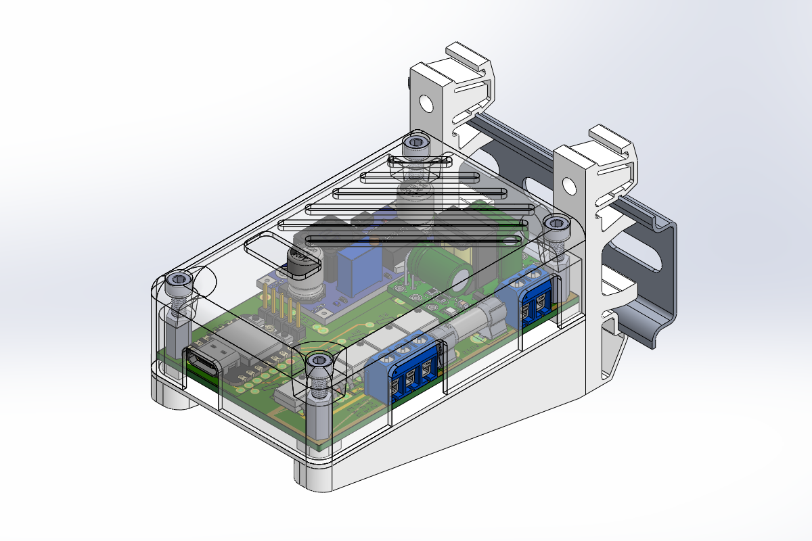
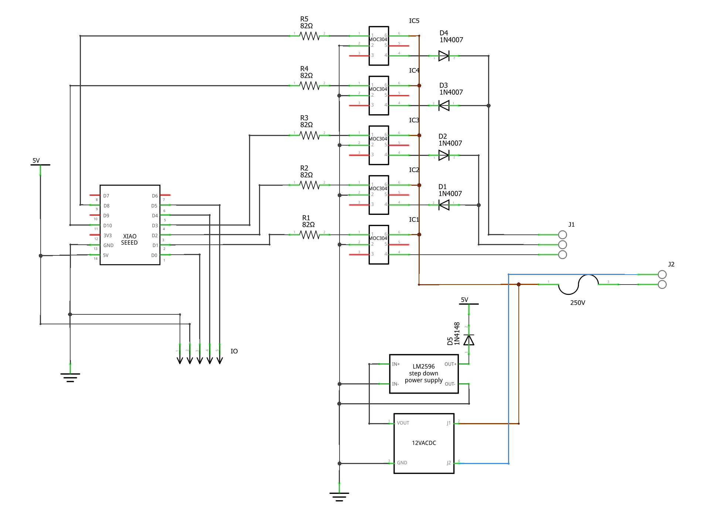

# heater controller

This is controller for electric heater with a control wire, widespread in France (Europe ?).

Inspired by [Jérôme Labidurie work](http://dinask.eu/hardware/filpilote/).

It can control two separate electric heaters with four orders (Confort, Éco, Hors gel, Arrêt) and one electric water tank (via controllable circuit beaker). It connects to your WiFi and has a nice web interface.

## Hardware

- Seeduino Xiao ESP32C3
- mini 12V AC/DC converter
- LM2596 step down regulator
- 5x MOC3041 triac driver
- 4x 1N4007 diode
- 1x 1N4141 diode
- 5x resistors
- 250V fuse
- terminals
- M3 screws and heated inserts
